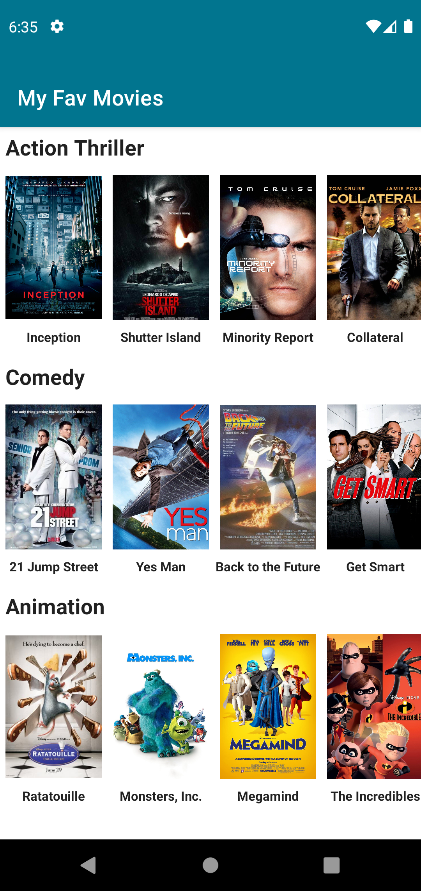

# About this project
 - It's a very small project to learn about Jetpack compose
 - We have used **LazyColumn, LazyRow, Column, Text, Image, Spacer** composable functions
 - For more information, please read the documentation [documentation](https://developer.android.com/jetpack/compose)
 - You need latest android studio canary version to run this project. You can download from [here](https://developer.android.com/studio/preview)

## Screenshots & GIF

&emsp;&emsp;

## Find this example useful? :heart:
Support it by joining __[stargazers](https://github.com/SimformSolutionsPvtLtd/Jetpack-compose-sample/stargazers)__ for this repository. :star:

## 🤝 How to Contribute

Whether you're helping us fix bugs, improve the docs, or a feature request, we'd love to have you! :muscle:

Check out our [**Contributing Guide**](https://github.com/SimformSolutionsPvtLtd/Jetpack-compose-sample/CONTRIBUTING.md) for ideas on contributing.

## Bugs and Feedback

For bugs, feature requests, and discussion please use [GitHub Issues](https://github.com/SimformSolutionsPvtLtd/Jetpack-compose-sample/issues).

### LICENSE
This project is licensed under the MIT License - see the [LICENSE](LICENSE) file for details
